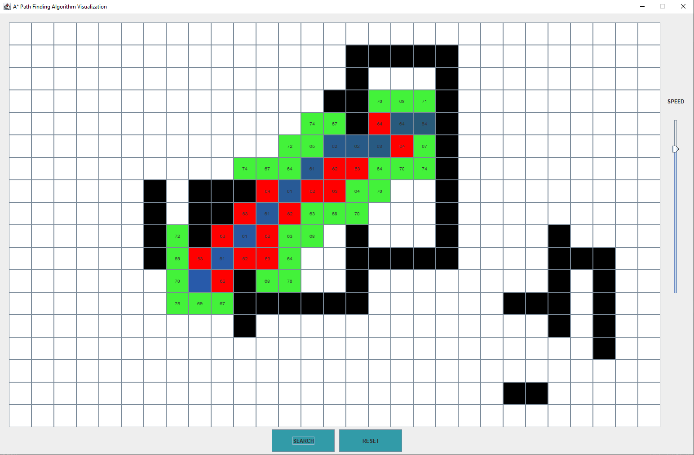

# a_star_path_finding_vis
<b><i>Visualization of A* Path Finding Algorithm</i></b> <br><br>
Refer to the A* Path Finding Algorithm: <a href="https://en.wikipedia.org/wiki/A*_search_algorithm">A* Algorithm</a> <br><br>
Three common metrics for calculating the heuristic distance between the destination and the current node has been provided:
<ul>
 <li><a href="https://en.wikipedia.org/wiki/Chebyshev_distance">Chebyshev Distance</a></li>
 <li><a href="https://en.wikipedia.org/wiki/Taxicab_geometry">Manhattan Distance</a></li>
 <li>Default Metric: <a href="https://en.wikipedia.org/wiki/Euclidean_distance">Euclidean Distance</a></li>
</ul>
<br>
Refer to the following memeber-function in the class <i>Cell</i>: <br>
```java
int get_distance(Cell cell, String metric)
```

<br> Here's an example output: <br>
<p align="center"></p>
While drawing the map, the following points are to be noted: <br>
<ul>
 <li>The first click selects the starting destination by turning it <b>blue</b></li>
 <li>The second click selects the ending destination by turning it <b>cyan</b></li>
 <li>The following clicks construct walls which cannot be traversed by turning them <b>black</b></li>
 <li>Clicking on a wall (black cell) will destroy the wall by turning the cell <b>white</b> again</li>
</ul>
<br>


